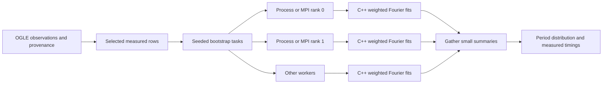

# THOTH's Beowulf and supercomputing laboratory

THOTH connects the original idea to a working scientific workload: Python loads
measured Mira photometry and schedules independent jobs; C++ performs weighted
Fourier period searches; Python collects the results and displays them. The
laboratory compares identical jobs serially, in local worker processes, and
through MPI. A Beowulf-style deployment runs MPI ranks on networked commodity
computers, each with its own memory and a compatible installation of THOTH.

The browser's local experiment launches processes on the machine serving THOTH.
Its worker badges show real process IDs and hostnames. MPI can use multiple
machines when launched through an appropriately configured MPI runtime or
scheduler. Several ranks on one hostname demonstrate MPI communication on one
execution environment. Hostnames alone cannot verify a number of physical
computers: containers and virtual machines also have names.

## The workload and its scientific meaning

The experiment loads an actual OGLE I-band light curve with its source URL and
HJD time system. The two bundled examples run without archive access; other
OGLE curves download through the catalog loader. GCVS summary entries without
linked time-series data report an error.

If the curve exceeds the requested observation limit, THOTH sorts rows by time
and selects evenly spaced **row indices**, including the first and last. This
selection preserves the temporal extent, but it reduces cadence information and
is explicitly recorded. It is a compute demonstration setting; a full scientific
analysis should inspect the complete curve.

Task `j` seeds Python's random generator with `1729 + j`, then samples the
selected `(time, magnitude, error)` rows with replacement. It adds no synthetic
brightness measurements or error perturbations. Serial and parallel tasks use
the same seeds; each task records the SHA-256 digest of its row indices.

Each sample goes to the native weighted, floating-mean Fourier search with two
harmonics. The default search spans 0.65 to 1.5 times the star's published catalog
period, with a 10-day lower floor; a missing usable period falls back to
50–1000 days. This keeps the bundled LMC example's published 1265-day period
inside its search window. The settings disclose the catalog period and bounds, and the command
line can override either bound. This is a catalog-informed exercise; broad
period discovery requires a separately justified search range.

**The period distribution is illustrative resampling output.** Independent-row
bootstrap assumptions are questionable for evolving Mira cycles and
time-correlated observations. The 16th/84th percentile values are not calibrated
astrophysical confidence limits. Cadence aliases, insufficient cycles, changing
periods, reduced row counts, and a finite frequency grid can change the result.
This pipeline provides empirical light-curve fitting; stellar pulsation physics
would require equations of state, radiative transfer, initial/boundary
conditions, and independently validated numerical solvers.

## Map, compute, reduce



The local executor assigns independent jobs through `ProcessPoolExecutor` and
collects futures as they finish. Spawned processes avoid inheriting a live native
thread runtime and support Windows. Each worker receives the selected rows once
through its initializer. Progress callbacks run in the parent.

In MPI mode, rank zero loads the curve and runs the serial baseline. After a
barrier, it broadcasts the selected rows. Rank `r` runs task indices
`r, r+P, r+2P, ...`, where `P` is the rank count. A gather returns compact fit
summaries to rank zero. Only rank zero prints/writes JSON. Expected task errors
are communicated so every rank can leave the collective path consistently.
The implementation follows mpi4py's documented Python-object
[broadcast and gather interfaces](https://mpi4py.github.io/mpi4py/stable/html/tutorial.html#collective-communication).

The C++ engine also has optional OpenMP parallelism across trial frequencies.
Local bootstrap tasks explicitly use one native thread. MPI offers
`--threads-per-rank` for hybrid MPI/OpenMP experiments. Keep
`ranks per node × threads per rank` within the CPUs allocated on that node, and
check `native_threads_used`: a serial build uses one even when more were
requested. Increasing both levels blindly can create CPU oversubscription and
make execution slower.

## Run the local laboratory

After installing/building THOTH:

```console
python -m thoth.cluster --local --workers 4 --tasks 24 --samples 800 --observations-limit 2400 --progress --output reports/cluster-local.json
python -m thoth.cluster --local --star OGLE-LMC-LPV-04312 --workers 4 --tasks 12 --output reports/cluster-lmc.json
```

Library callers can use `run_cluster_experiment(star_id, workers, tasks, samples,
observations_limit, progress=callback)`. Scripts using spawned multiprocessing
must place their call under `if __name__ == '__main__':`. The helper
`benchmark_observations(...)` accepts explicit measured rows and period limits.
Synthetic rows appear only in numerical tests.

Local command-line bounds are 1–8 workers, 1–48 tasks, 16–1200 frequency samples,
and 7–3000 selected observations. The browser/API requires at least 2 tasks,
50 frequency samples, and 50 selected observations, with the same maxima. MPI
permits 1–128 ranks and 1–4096 tasks, retaining the command-line per-fit
sample/observation limits. These bounds keep the interactive
demonstration manageable; they are not an advertised supercomputer capacity.

## Run MPI

MPI is optional. Use your cluster's configured MPI installation and Python
environment. For a convenient Windows AMD64 or Linux x86_64 environment, the
mpi4py project documents the Intel runtime wheel combination:

```console
python -m pip install mpi4py impi-rt
mpiexec -n 4 python -m thoth.cluster --mpi --tasks 24 --samples 800 --observations-limit 2400 --output reports/cluster-mpi.json
```

With the Windows Intel wheel, the launcher may be at
`.venv/Library/bin/mpiexec.exe`; mpi4py's Windows instructions explain runtime
DLL discovery through `I_MPI_ROOT`. Linux/macOS can also use MPICH/Open MPI
wheels or a system runtime. For production clusters, use the MPI build provided
by the site. See the primary
[mpi4py installation instructions](https://mpi4py.readthedocs.io/en/stable/install.html).

A hybrid example uses two native threads per MPI rank:

```console
mpiexec -n 4 python -m thoth.cluster --mpi --threads-per-rank 2 --tasks 48 --samples 1200 --observations-limit 3000 --output reports/cluster-hybrid.json
```

The serial baseline uses the same native thread count as each MPI task. Thus
this ratio measures adding MPI ranks at a fixed thread count per task; it does
not compare an eight-core hybrid configuration to a single-core baseline.

`examples/cluster.slurm` shows a two-node/four-rank allocation with two CPUs per
rank. Change the environment activation, partition/account, and MPI launch
plugin for your site. The sample uses PMIx, which requires matching Slurm and
MPI configuration. Consult the official
[Slurm MPI guide](https://slurm.schedmd.com/mpi_guide.html) and
[srun CPU allocation options](https://slurm.schedmd.com/srun.html).

## Read measured timings honestly

For a fixed set of tasks:

```
speedup = serial_seconds / parallel_seconds
efficiency = speedup / requested_workers
```

Serial timing includes resampling, C++ fitting, summary construction, and parent
progress callbacks. Local parallel timing additionally includes process startup,
row transfer, scheduling, IPC, and shutdown. Source loading/selection are
excluded from both and recorded as `preparation_seconds`.

MPI uses [MPI.Wtime](https://mpi4py.github.io/mpi4py/stable/html/reference/mpi4py.MPI.Wtime.html)
durations and a maximum reduction across ranks. Its parallel timer covers input
broadcast, assigned fits, and result gather. It excludes `mpiexec` launch and
the final timing reduction. This timing scope differs from the local timer;
compare like-for-like runs. No timestamp synchronization across computers is
assumed.

`node_results` groups tasks by `(hostname, worker_pid)` and records completed
task indices and summed task durations. Its `compute_seconds` includes
resampling and summary work; it is not pure native-kernel CPU time. Concurrent
task durations do not sum to elapsed wall time. `same_task_results` checks row
digests and fit summaries against the serial baseline. Small tasks can have
speedup below one because launch and communication dominate.

## Strong scaling, weak scaling, and useful limits

Strong scaling keeps the dataset, task count, grid, and per-task threads fixed
while changing the worker count. Weak scaling keeps work per worker fixed while
increasing the total task count. Repeat each run and report median wall times;
record software versions, CPU allocation, hostnames, data settings, and background
load. The executable `examples/cluster_scaling.py` performs repeated local
strong/weak studies and saves their measured reports.

Two idealized models are exposed as pure functions:

```
Amdahl:    S(P) = 1 / ((1-p) + p/P)
Gustafson: S(P) = P - s*(P-1)
```

Here `p` is the parallel fraction of a fixed-work serial program; `s` is the
serial fraction of a scaled-work run. The returned model curves assume
`p=0.95` and `s=0.05` for teaching. They are not fitted measurements. Their
definitions and the distinction between fixed and scaled work are discussed in
Victor Eijkhout's author-published
[Parallel Computing chapter](https://theartofhpc.com/istc/parallel.html).

THOTH's task-level decomposition has little communication during fitting. A
larger physical pulsation solver might require neighboring-cell exchanges on
every time step, introducing a substantially different bottleneck. Memory
replication also matters: this demonstration stores a complete selected curve
in each worker. Large surveys would benefit from partitioned data, bounded task
queues, and compact numerical buffers. mpi4py provides buffer-based collectives
for that next stage; the current small-row broadcast uses Python serialization.

Record worker CPU utilization, resident memory, queue delays, per-task timing
spread, network throughput, and failed-task counts when moving to a real
cluster. Check load balance, affinity/NUMA placement, archive/cache I/O, and
network latency separately. THOTH reports the execution evidence it observes;
benchmarking multiple physical nodes requires actually running on those nodes.

## Verification

The default tests execute spawned processes, compare serial/parallel seeded
results, check measured OGLE provenance, and validate resource limits and
scaling formulas. To include the optional real two-rank MPI integration test:

```console
THOTH_TEST_MPI=1 python -m pytest tests/test_cluster.py
```

On PowerShell use `$env:THOTH_TEST_MPI='1'` before the pytest command. If the
launcher is outside `PATH`, set `THOTH_MPIEXEC` to its full path. The optional
test verifies both ranks completed assigned work and rank zero wrote a valid
JSON report. It does not require or claim multiple physical nodes.
