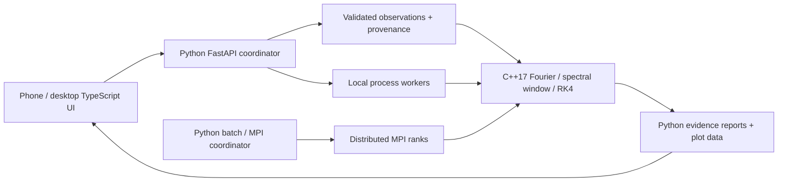

# THOTHv2: from observations to questions worth computing

THOTH's purpose is to make Mira research inspectable: select a star, ask a
question, run real numerical work, see the evidence, and decide what observation
or stronger model could move the question forward. The original C/Python
experiment is preserved in Git history and `legacy/`. Version 2 builds on that
idea with native mathematical kernels, Python orchestration, TypeScript
interaction, and genuine process/MPI execution.

## Working architecture

The interface includes an indexed catalog and sky map, a measured-light-curve
fitter, a Discovery Lab, a Pulsation Sandbox, and a Compute Lab. Every diagram
and chart is backed by returned measurements or a named model. Science runs on
the host rather than on the phone. Python validates inputs, computes report
statistics, selects workflows, retains provenance and prepares plot data; C++
performs frequency searches, weighted least squares, sampling-window sums and
RK4 integration. TypeScript handles interaction and browser rendering.

Discovery Lab compares Fourier models on an earlier/later split, reports
weighted held-out errors and information criteria, exposes residuals and
separated frequency peaks, computes the actual cadence window, compares
early/late fitted periods, and ranks hypothetical future times at which
competing fitted hypotheses disagree. Inputs can be bundled measured OGLE data,
archive photometry, or an explicitly labeled single-band user CSV. Imported
datasets and completed research reports survive server restarts in the local
workspace; in-flight job state is process-local and interrupted jobs must be
rerun. Downloading an evidence report keeps a portable copy.

Pulsation Sandbox solves a driven, damped nonlinear oscillator with native RK4.
It lets an investigator explore forcing, damping, phase motion, work and
energy, and compare the same integration at two step sizes. These are
normalized numerical experiments. They teach nonlinear dynamics and numerical
accuracy; their controls do not determine a real star's radius or luminosity.

Compute Lab runs identical seeded bootstrap tasks serially and through process
workers, reporting measured time, actual worker PIDs, task allocation and
agreement. MPI sends the native work to ranks and records real hostnames.
Single-host ranks demonstrate the execution model; only multi-host execution
demonstrates a physical Beowulf cluster. Slurm examples and strong/weak scaling
experiments make that extension concrete. The interactive API runs one
resource-intensive experiment at a time; a production scheduler is future work.

## What resolving an unknown means

A useful result narrows a question with evidence. For example: which searched
periods fit the measurements, whether extra harmonics improve prediction of
later measurements, whether the cadence could introduce ambiguity, where a
stationary periodic model fails, and when alternative fitted hypotheses predict
different observations. A ranked hypothesis is not a discovery, a cadence
feature is not proof of an alias, and numerical convergence is not physical
validation. Observing suggestions are offsets from the dataset's final
measurement and may therefore be historical; they are not today's telescope
calendar.

Mira variability itself makes simple inference incomplete. Cycle-to-cycle
changes can coexist with longer-term period changes; see the primary study of
[547 Mira period histories](https://arxiv.org/abs/astro-ph/0504527).
Survey evidence also includes candidate changing-period and multiperiodic
objects: [ASAS Mira analysis](https://arxiv.org/abs/1609.05246). THOTH exposes
these kinds of questions without assuming the periodic Fourier model answers
their physical cause. A single band's brightness history does not uniquely
identify stellar mass, distance, temperature, chemistry, convection, shock
physics or evolutionary state.

## Next research milestones

1. **More trustworthy observational constraints.** Cross-match source catalogs
   with explicit positional and identity uncertainty; integrate additional
   passbands, parallax and spectroscopy with their provenance and selection
   effects. Preserve missing values and ambiguous matches.
2. **Statistical inference.** Extend the implemented quadratic-phase search and
   conditional independent-noise injection/recovery experiments with correlated
   noise, calibrated evolving-period uncertainty estimates, untouched
   predictive validation and cadence-aware selection tests. Model disagreement
   alone is not a posterior probability or false-alarm significance.
3. **Physical pulsation.** Implement documented radial stellar structure,
   equation-of-state, opacity, radiative transfer and convection assumptions;
   compare against established calculations and independent observations.
   The current Duffing analogy is not a substitute for those equations.
4. **Distributed inference at scale.** Extend the implemented MPI ensemble farm
   to survey-wide hypothesis grids, add resumable tasks and checkpoints, then
   benchmark actual multiple-node strong/weak scaling under a batch scheduler.
   Record allocation, communication, setup time and failures separately.
5. **Observation planning.** Turn conditional disagreement into an observing
   schedule only after adding current-time prediction uncertainty, sky
   visibility, telescope/passband constraints and realistic measurement noise.

These milestones are a roadmap. Today's application implements the empirical
research, numerical sandbox and measured parallel-compute workflow described
above. It can help investigate unanswered questions; it cannot promise that
every astrophysical unknown is identifiable or solvable.

## Development and packaging

Use the native Python/C++ build and TypeScript tooling for development and the
current internal demo. [INTERNAL_RUN.md](INTERNAL_RUN.md) describes the launcher
and phone access. Optional Docker packaging produces a final internal runtime
with compiled assets, native science, MPI and persistent workspace storage;
it is validated in container CI and does not require installing Docker on this
development computer. [RESEARCH.md](RESEARCH.md), [CLUSTER.md](CLUSTER.md) and
[SOURCES.md](SOURCES.md) document methods, cluster execution and catalog coverage.
[TRANSFORMS.md](TRANSFORMS.md) describes the implemented frequency/drift and
localized maps, phase dispersion, structure functions and distributed recovery
experiments. These empirical models expose additional questions; stellar
interior calculations remain a separate physical milestone.
